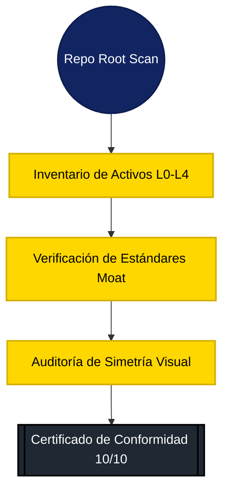

# Knowledge Graph: Gobernanza y Auditoría

## 1. Mapa de Conformidad

```mermaid
graph TD
    %% Classes Definition
    classDef strategy fill:#122562,stroke:#0f1d4f,stroke-width:2px,color:#fff;
    classDef skill fill:#FFD700,stroke:#d4af00,stroke-width:2px,color:#000;
    classDef evidence fill:#1F2833,stroke:#000,stroke-width:2px,color:#fff;

    %% Nodes
    Root((Repo Root Scan)):::strategy
    Inventory[Inventario de Activos L0-L4]:::skill
    StandardCheck[Verificación de Estándares Moat]:::skill
    SymmetryAudit[Auditoría de Simetría Visual]:::skill
    
    Report[[Certificado de Conformidad 10/10]]:::evidence

    %% Relationships
    Root --> Inventory
    Inventory --> StandardCheck
    StandardCheck --> SymmetryAudit
    SymmetryAudit --> Report
```

---

### Compliance Architecture v2.2.0 (Moat Edition)

