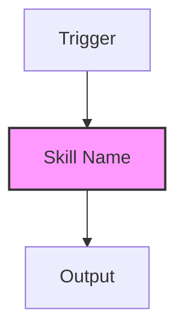

# 068-crear-knowledge-graph-metodologia v1.0.0 (Moat Edition)

## 0. Scaffolding (Moat Edition)

> **Standard**: This skill adheres to the **MetodologIA Moat Standard**.
>
- **SOTA**: `references/estado-del-arte.md`
- **Governance**: `references/best-practices.md`
- **Ontology**: `meta/knowledge-graph.md`

## 1. Goal

Generar grafos de conocimiento estructurados en Mermaid que mapeen de forma inequívoca la relación entre intenciones, procesos y evidencias de un skill o entidad operativa. Este skill asegura que la arquitectura visual de MetodologIA sea coherente y auto-explicativa.

## 2. Meta-Protocol: Visual Triple Loop

1.  **Loop 1 (Fidelidad Física):** ¿Cada nodo del grafo corresponde a un archivo o entidad real en el repo?
2.  **Loop 2 (Coherencia Lógica):** ¿Las flechas de dependencia reflejan el orden real de ejecución (Pre-requisitos)?
3.  **Loop 3 (Impacto Cognitivo):** ¿El grafo permite diagnosticar una brecha operativa en menos de 30 segundos?

## 3. Protocolo de Ejecución

### 3.1 Fase de Abstracción (Observe)

- **SCAN:** Revisar el `SKILL.md` o el `L3` objetivo.
- **ENTITY IDENTIFICATION:** Listar los 5-10 componentes clave (Entradas, Procesos, Gates, Salidas).

### 3.2 Fase de Diseño (Act)

- **TOP-DOWN FLOW:** Iniciar Mermaid con `graph TD`.
- **NODE STYLING:** Aplicar clases de estilo para diferenciar "Skills", "Files" y "Actions".
- **SCAFFOLDING:** Escribir el output prioritariamente en `meta/knowledge-graph.md`.

### 3.3 Fase de Verificación (Verify)

- **LINT CHECK:** Validar sintaxis Mermaid.
- **LINK INTEGRITY:** Asegurar que los nombres en el grafo coincidan con los `references/` creados.

## 4. Estándar Visual Mermaid

## 5. Changelog
- v1.0.0 — Versión inicial: Generación estructurada de grafos Moat-Ready.

---
Powered by MetodologIA Architecture Protocol

<!--
  @license Copyleft
  @copyright MetodologIA
  @author Javier Montaño
  @steward Javier Montaño
  @technology Antigravity | GoogleAI Studio | Gemini 3 Pro | Gemini 3 Flash
  @poweredBy Pristino Agent
-->
