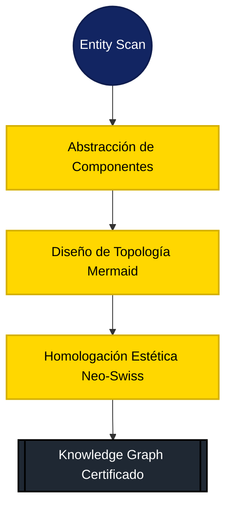

# Knowledge Graph: Creación de Knowledge Graphs

## 1. Arquitectura de Grafos (Sovereign UI)

```mermaid
graph TD
    %% Classes Definition
    classDef strategy fill:#122562,stroke:#0f1d4f,stroke-width:2px,color:#fff;
    classDef skill fill:#FFD700,stroke:#d4af00,stroke-width:2px,color:#000;
    classDef evidence fill:#1F2833,stroke:#000,stroke-width:2px,color:#fff;

    %% Nodes
    Scan((Entity Scan)):::strategy
    Abstraction[Abstracción de Componentes]:::skill
    Topology[Diseño de Topología Mermaid]:::skill
    Standardization[Homologación Estética Neo-Swiss]:::skill
    
    Graph[[Knowledge Graph Certificado]]:::evidence

    %% Relationships
    Scan --> Abstraction
    Abstraction --> Topology
    Topology --> Standardization
    Standardization --> Graph
```

---

### Graph Generation Architecture v1.0.0 (Moat Edition)

