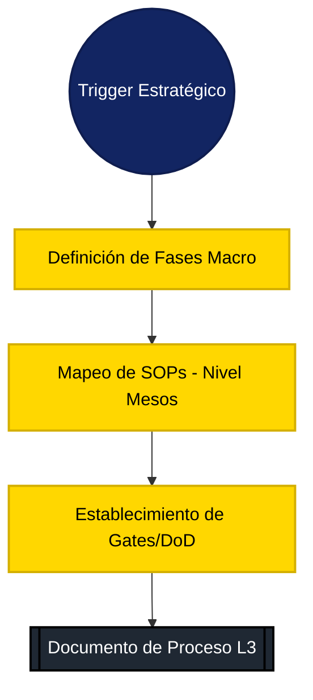

# Knowledge Graph: Diseño de Procesos

## 1. Mapa de Flujo Canónico

```mermaid
graph TD
    %% Classes Definition
    classDef strategy fill:#122562,stroke:#0f1d4f,stroke-width:2px,color:#fff;
    classDef skill fill:#FFD700,stroke:#d4af00,stroke-width:2px,color:#000;
    classDef evidence fill:#1F2833,stroke:#000,stroke-width:2px,color:#fff;

    %% Nodes
    Trigger((Trigger Estratégico)):::strategy
    Phases[Definición de Fases Macro]:::skill
    SOPMap[Mapeo de SOPs - Nivel Mesos]:::skill
    Gates[Establecimiento de Gates/DoD]:::skill
    
    L1[[Documento de Proceso L3]]:::evidence

    %% Relationships
    Trigger --> Phases
    Phases --> SOPMap
    SOPMap --> Gates
    Gates --> L1
```

---

### Process Architecture v2.2.0 (Moat Edition)

