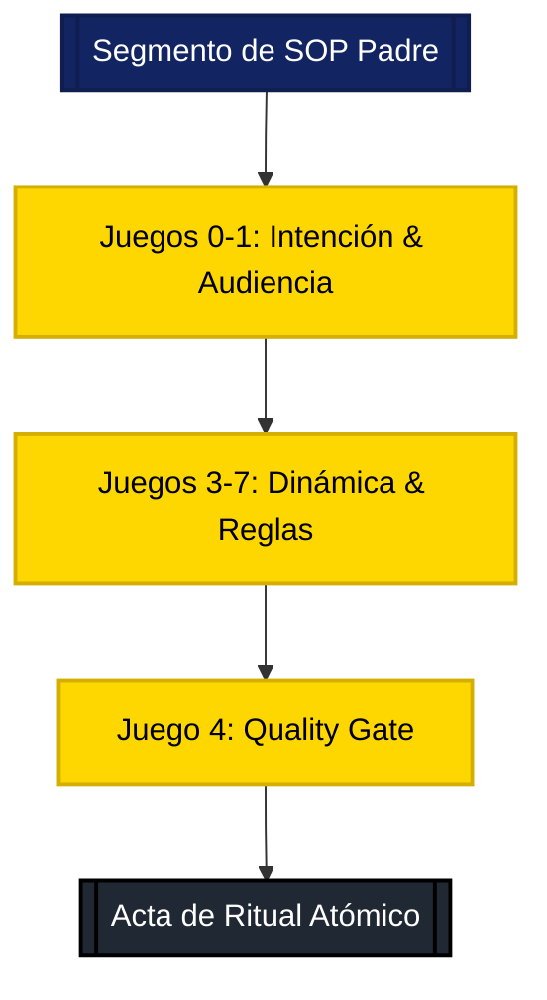

# Knowledge Graph: Ejecución de Rituales

## 1. Arquitectura de Ritual (Sovereign UI)

```mermaid
graph TD
    %% Classes Definition
    classDef strategy fill:#122562,stroke:#0f1d4f,stroke-width:2px,color:#fff;
    classDef skill fill:#FFD700,stroke:#d4af00,stroke-width:2px,color:#000;
    classDef evidence fill:#1F2833,stroke:#000,stroke-width:2px,color:#fff;

    %% Nodes
    SOP[[Segmento de SOP Padre]]:::strategy
    Identify[Juegos 0-1: Intención & Audiencia]:::skill
    Execution[Juegos 3-7: Dinámica & Reglas]:::skill
    Validation[Juego 4: Quality Gate]:::skill
    
    RitualDoc[[Acta de Ritual Atómico]]:::evidence

    %% Relationships
    SOP --> Identify
    Identify --> Execution
    Execution --> Validation
    Validation --> RitualDoc
```

---
### Ritual Architecture v2.2.0 (Moat Edition)

