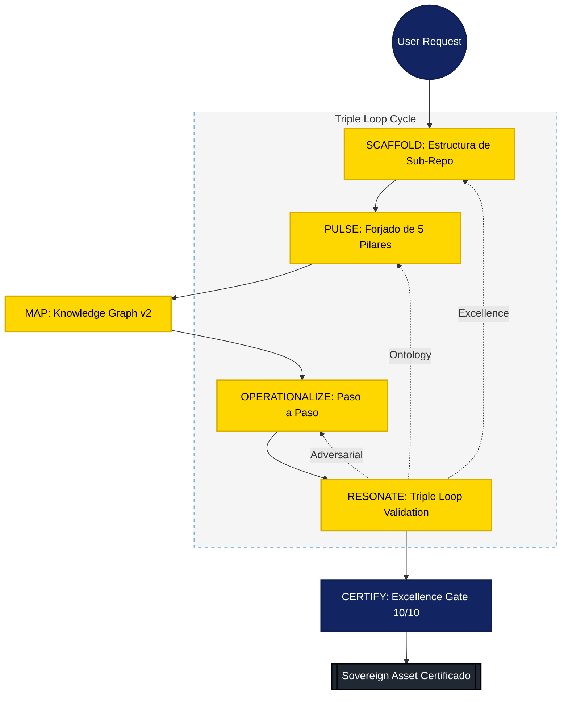

# Knowledge Graph: Cognitive Loop of `crear-skill-metodologia`

## 1. Mapa de Relaciones Lógicas (Moat Edition)

El skill opera como un sistema de **Retroalimentación de Triple Loop**. El BoK fundamenta la lógica, los Use Cases validan la utilidad y el "Factor Sorpresa" garantiza la diferenciación competitiva (Moat).

## 2. Diagrama de Arquitectura (Sovereign UI)

## 3. Dinámica de Ejecución

El "Factor Sorpresa" se activa en la fase **Resonate**, donde el agente inyecta lógica defensiva y trazabilidad de élite basada en los pilares forjados en la fase **Pulse**.

---

### Cognitive Architecture v2.2.0 (Moat Edition)

