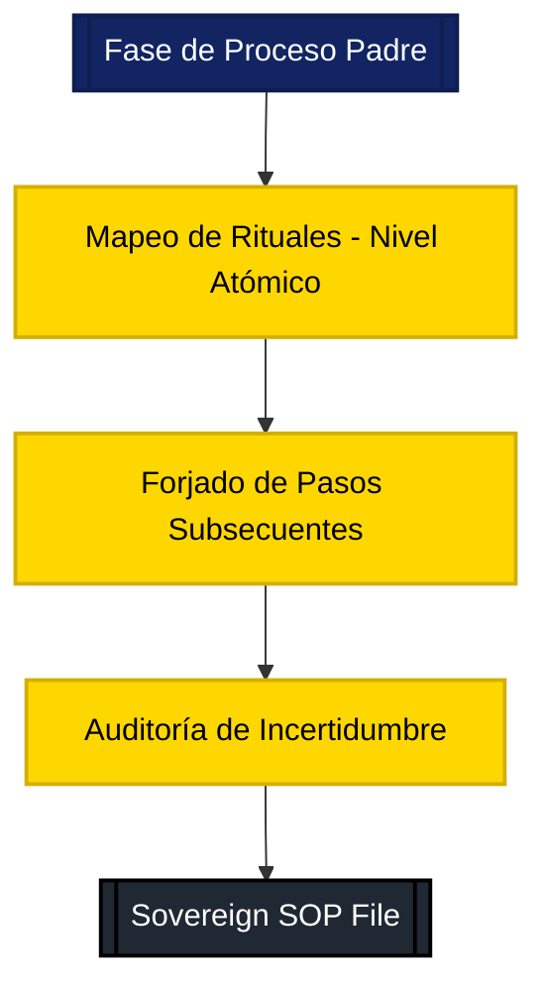

# Knowledge Graph: Forjado de SOPs

## 1. Mapa de Ejecución Atómica

```mermaid
graph TD
    %% Classes Definition
    classDef strategy fill:#122562,stroke:#0f1d4f,stroke-width:2px,color:#fff;
    classDef skill fill:#FFD700,stroke:#d4af00,stroke-width:2px,color:#000;
    classDef evidence fill:#1F2833,stroke:#000,stroke-width:2px,color:#fff;

    %% Nodes
    Process[[Fase de Proceso Padre]]:::strategy
    RitualMap[Mapeo de Rituales - Nivel Atómico]:::skill
    StepForging[Forjado de Pasos Subsecuentes]:::skill
    UncertaintyAudit[Auditoría de Incertidumbre]:::skill
    
    SOP[[Sovereign SOP File]]:::evidence

    %% Relationships
    Process --> RitualMap
    RitualMap --> StepForging
    StepForging --> UncertaintyAudit
    UncertaintyAudit --> SOP
```

---

### SOP Architecture v2.1.0 (Moat Edition)

