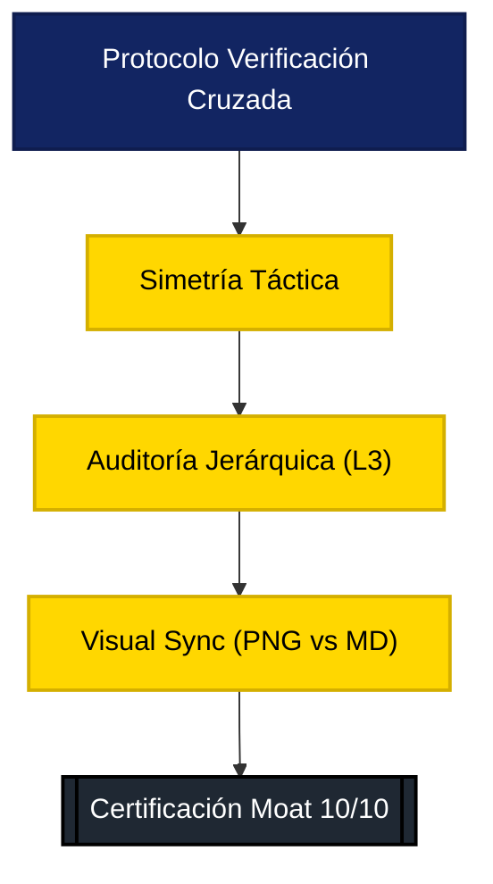

# Knowledge Graph: QA & Coherence Assurance

```mermaid
graph TD
    %% Classes Definition
    classDef strategy fill:#122562,stroke:#0f1d4f,stroke-width:2px,color:#fff;
    classDef skill fill:#FFD700,stroke:#d4af00,stroke-width:2px,color:#000;
    classDef evidence fill:#1F2833,stroke:#000,stroke-width:2px,color:#fff;

    %% Nodes
    PVC["Protocolo Verificación Cruzada"]:::strategy
    ST["Simetría Táctica"]:::skill
    Audit["Auditoría Jerárquica (L3)"]:::skill
    Sync["Visual Sync (PNG vs MD)"]:::skill
    
    Cert[[Certificación Moat 10/10]]:::evidence

    %% Relationships
    PVC --> ST
    ST --> Audit
    Audit --> Sync
    Sync --> Cert
```

