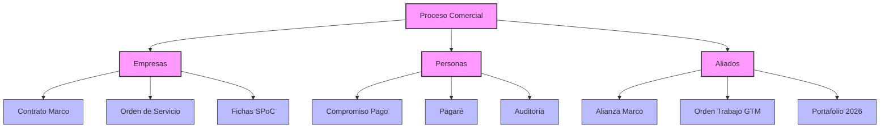

```mermaid
graph TD
    %% Core Nodes
    Comercial[Proceso Comercial]
    B2B[Empresas]
    B2C[Personas]
    GTM[Aliados]

    %% Relationships
    Comercial --> B2B
    Comercial --> B2C
    Comercial --> GTM

    %% B2B Assets
    B2B --> ContractB2B[Contrato Marco]
    B2B --> OdSB2B[Orden de Servicio]
    B2B --> SPoC[Fichas SPoC]

    %% B2C Assets
    B2C --> ContractB2C[Compromiso Pago]
    B2C --> Pagare[Pagaré]
    B2C --> Auditoria[Auditoría]

    %% GTM Assets
    GTM --> ContractGTM[Alianza Marco]
    GTM --> OdSGTM[Orden Trabajo GTM]
    GTM --> Portfolio[Portafolio 2026]

    %% Styles
    classDef meta fill:#f9f,stroke:#333,stroke-width:2px;
    classDef asset fill:#bbf,stroke:#333,stroke-width:1px;
    
    class Comercial,B2B,B2C,GTM meta;
    class ContractB2B,OdSB2B,SPoC,ContractB2C,Pagare,Auditoria,ContractGTM,OdSGTM,Portfolio asset;
```
