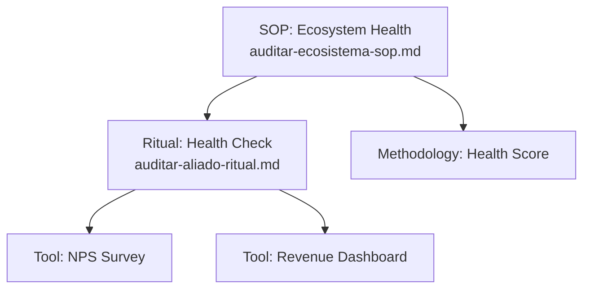

# Knowledge Graph: Audit GTM

```mermaid
graph TD
    SOP["SOP: Ecosystem Health<br/>auditar-ecosistema-sop.md"] --> R1["Ritual: Health Check<br/>auditar-aliado-ritual.md"]
    SOP --> M1["Methodology: Health Score"]
    R1 --> T1["Tool: NPS Survey"]
    R1 --> T2["Tool: Revenue Dashboard"]
```
