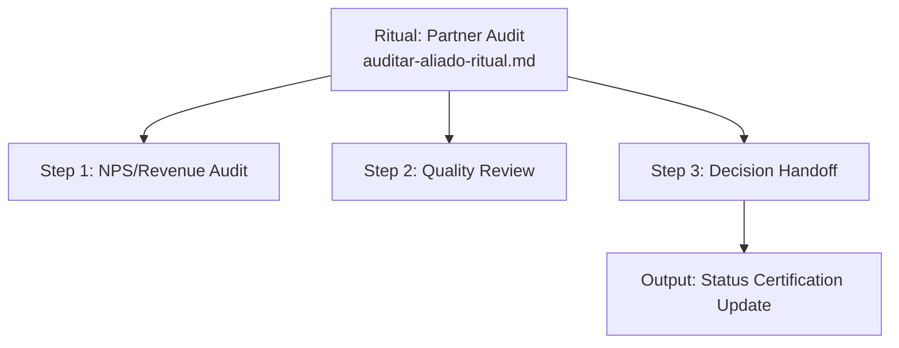

# Knowledge Graph: Partner Audit

```mermaid
graph TD
    RITUAL["Ritual: Partner Audit<br/>auditar-aliado-ritual.md"] --> S1["Step 1: NPS/Revenue Audit"]
    RITUAL --> S2["Step 2: Quality Review"]
    RITUAL --> S3["Step 3: Decision Handoff"]
    S3 --> T1["Output: Status Certification Update"]
```
