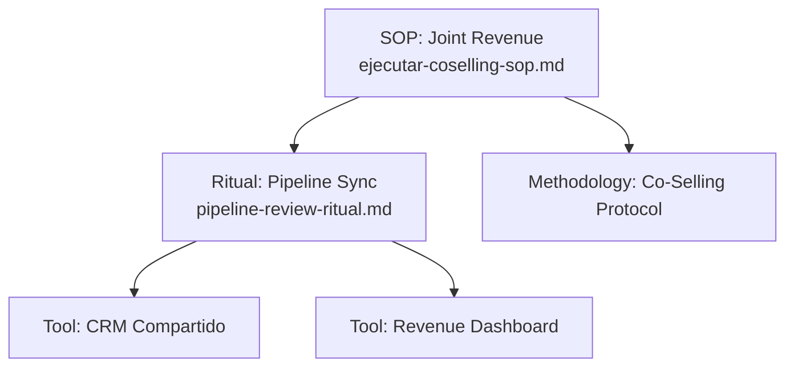

# Knowledge Graph: Co-Selling GTM

```mermaid
graph TD
    SOP["SOP: Joint Revenue<br/>ejecutar-coselling-sop.md"] --> R1["Ritual: Pipeline Sync<br/>pipeline-review-ritual.md"]
    SOP --> M1["Methodology: Co-Selling Protocol"]
    R1 --> T1["Tool: CRM Compartido"]
    R1 --> T2["Tool: Revenue Dashboard"]
```
