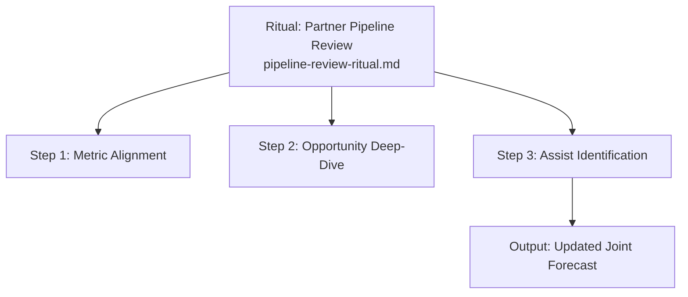

# Knowledge Graph: Partner Pipeline Review

```mermaid
graph TD
    RITUAL["Ritual: Partner Pipeline Review<br/>pipeline-review-ritual.md"] --> S1["Step 1: Metric Alignment"]
    RITUAL --> S2["Step 2: Opportunity Deep-Dive"]
    RITUAL --> S3["Step 3: Assist Identification"]
    S3 --> T1["Output: Updated Joint Forecast"]
```
