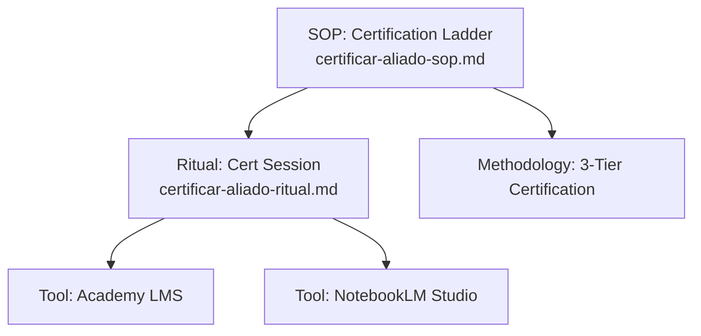

# Knowledge Graph: Onboarding GTM

```mermaid
graph TD
    SOP["SOP: Certification Ladder<br/>certificar-aliado-sop.md"] --> R1["Ritual: Cert Session<br/>certificar-aliado-ritual.md"]
    SOP --> M1["Methodology: 3-Tier Certification"]
    R1 --> T1["Tool: Academy LMS"]
    R1 --> T2["Tool: NotebookLM Studio"]
```
