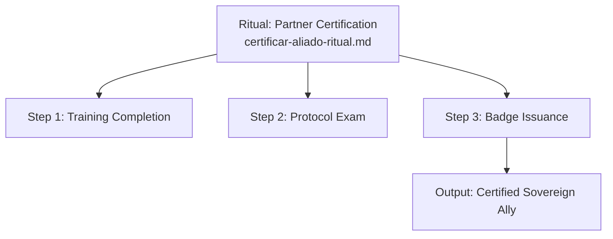

# Knowledge Graph: Partner Certification

```mermaid
graph TD
    RITUAL["Ritual: Partner Certification<br/>certificar-aliado-ritual.md"] --> S1["Step 1: Training Completion"]
    RITUAL --> S2["Step 2: Protocol Exam"]
    RITUAL --> S3["Step 3: Badge Issuance"]
    S3 --> T1["Output: Certified Sovereign Ally"]
```
