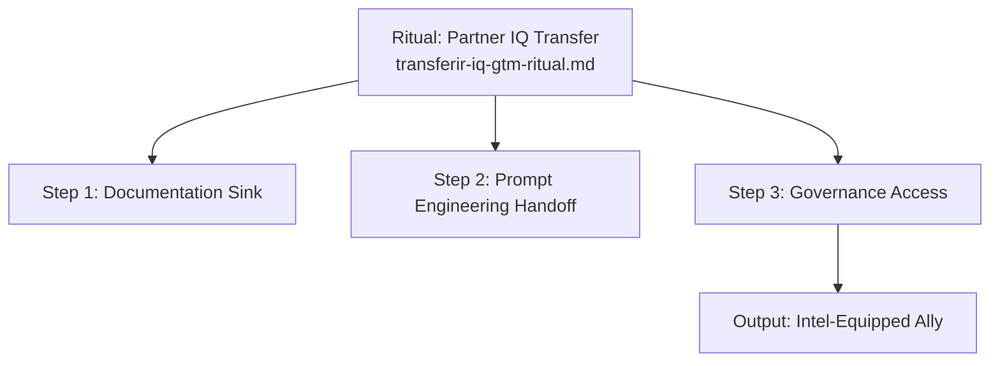

# Knowledge Graph: Partner IQ Transfer

```mermaid
graph TD
    RITUAL["Ritual: Partner IQ Transfer<br/>transferir-iq-gtm-ritual.md"] --> S1["Step 1: Documentation Sink"]
    RITUAL --> S2["Step 2: Prompt Engineering Handoff"]
    RITUAL --> S3["Step 3: Governance Access"]
    S3 --> T1["Output: Intel-Equipped Ally"]
```
