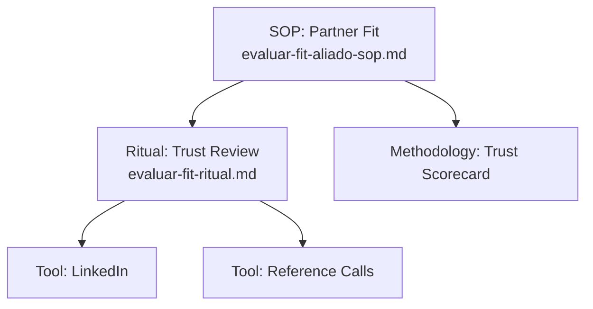

# Knowledge Graph: Scouting GTM

```mermaid
graph TD
    SOP["SOP: Partner Fit<br/>evaluar-fit-aliado-sop.md"] --> R1["Ritual: Trust Review<br/>evaluar-fit-ritual.md"]
    SOP --> M1["Methodology: Trust Scorecard"]
    R1 --> T1["Tool: LinkedIn"]
    R1 --> T2["Tool: Reference Calls"]
```
