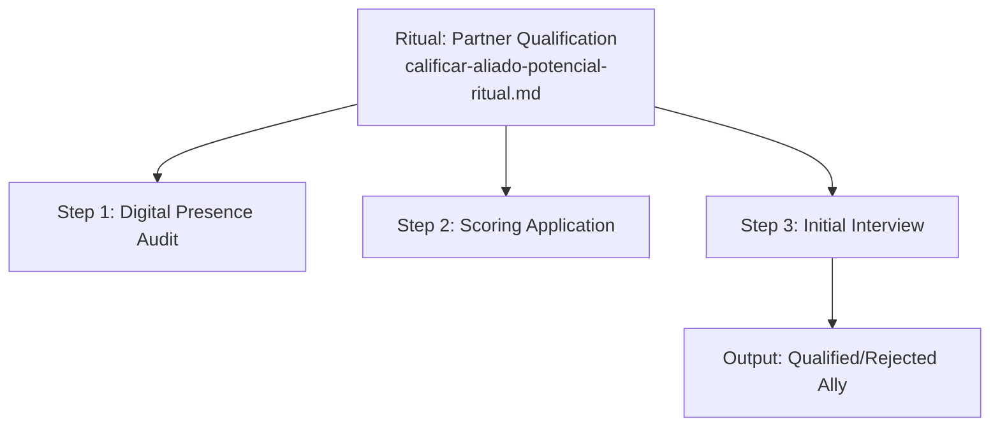

# Knowledge Graph: Partner Qualification

```mermaid
graph TD
    RITUAL["Ritual: Partner Qualification<br/>calificar-aliado-potencial-ritual.md"] --> S1["Step 1: Digital Presence Audit"]
    RITUAL --> S2["Step 2: Scoring Application"]
    RITUAL --> S3["Step 3: Initial Interview"]
    S3 --> T1["Output: Qualified/Rejected Ally"]
```
