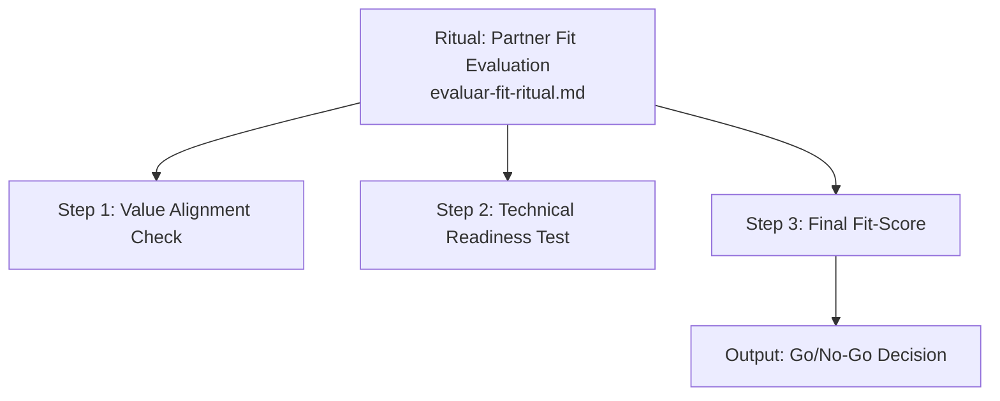

# Knowledge Graph: Partner Fit Evaluation

```mermaid
graph TD
    RITUAL["Ritual: Partner Fit Evaluation<br/>evaluar-fit-ritual.md"] --> S1["Step 1: Value Alignment Check"]
    RITUAL --> S2["Step 2: Technical Readiness Test"]
    RITUAL --> S3["Step 3: Final Fit-Score"]
    S3 --> T1["Output: Go/No-Go Decision"]
```
