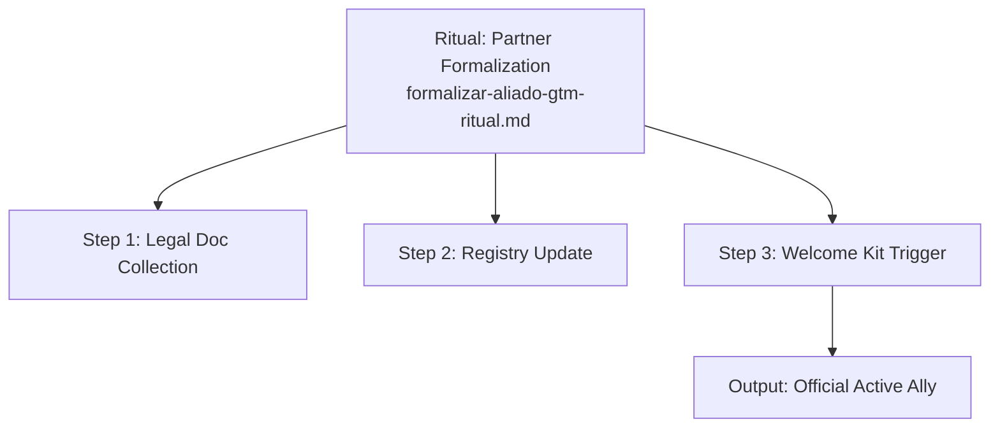

# Knowledge Graph: Partner Formalization

```mermaid
graph TD
    RITUAL["Ritual: Partner Formalization<br/>formalizar-aliado-gtm-ritual.md"] --> S1["Step 1: Legal Doc Collection"]
    RITUAL --> S2["Step 2: Registry Update"]
    RITUAL --> S3["Step 3: Welcome Kit Trigger"]
    S3 --> T1["Output: Official Active Ally"]
```
