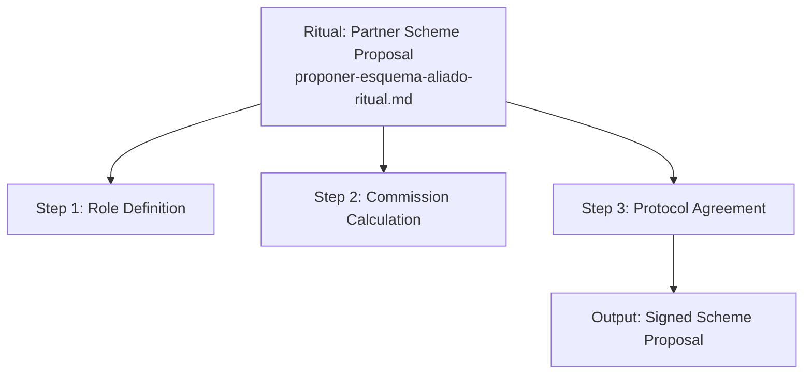

# Knowledge Graph: Partner Scheme Proposal

```mermaid
graph TD
    RITUAL["Ritual: Partner Scheme Proposal<br/>proponer-esquema-aliado-ritual.md"] --> S1["Step 1: Role Definition"]
    RITUAL --> S2["Step 2: Commission Calculation"]
    RITUAL --> S3["Step 3: Protocol Agreement"]
    S3 --> T1["Output: Signed Scheme Proposal"]
```
