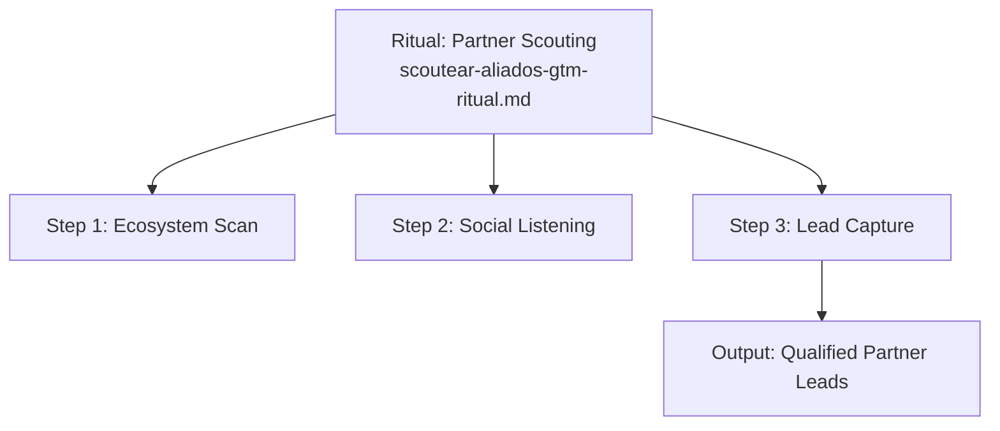

# Knowledge Graph: Partner Scouting

```mermaid
graph TD
    RITUAL["Ritual: Partner Scouting<br/>scoutear-aliados-gtm-ritual.md"] --> S1["Step 1: Ecosystem Scan"]
    RITUAL --> S2["Step 2: Social Listening"]
    RITUAL --> S3["Step 3: Lead Capture"]
    S3 --> T1["Output: Qualified Partner Leads"]
```
