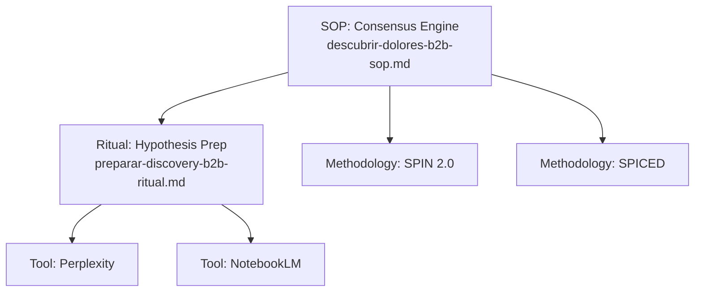

# Knowledge Graph: Discovery B2B

```mermaid
graph TD
    SOP["SOP: Consensus Engine<br/>descubrir-dolores-b2b-sop.md"] --> R1["Ritual: Hypothesis Prep<br/>preparar-discovery-b2b-ritual.md"]
    SOP --> M1["Methodology: SPIN 2.0"]
    SOP --> M2["Methodology: SPICED"]
    R1 --> T1["Tool: Perplexity"]
    R1 --> T2["Tool: NotebookLM"]
```
