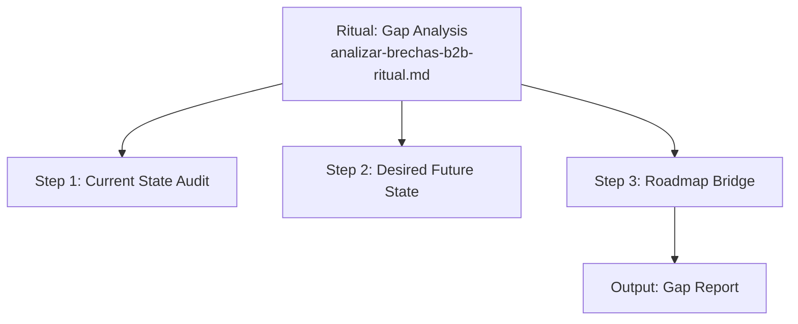

# Knowledge Graph: B2B Gap Analysis

```mermaid
graph TD
    RITUAL["Ritual: Gap Analysis<br/>analizar-brechas-b2b-ritual.md"] --> S1["Step 1: Current State Audit"]
    RITUAL --> S2["Step 2: Desired Future State"]
    RITUAL --> S3["Step 3: Roadmap Bridge"]
    S3 --> T1["Output: Gap Report"]
```
