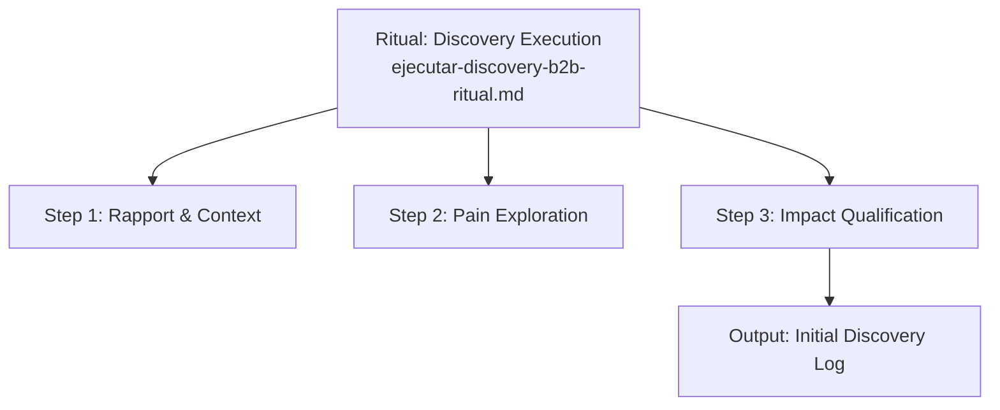

# Knowledge Graph: B2B Discovery Execution

```mermaid
graph TD
    RITUAL["Ritual: Discovery Execution<br/>ejecutar-discovery-b2b-ritual.md"] --> S1["Step 1: Rapport & Context"]
    RITUAL --> S2["Step 2: Pain Exploration"]
    RITUAL --> S3["Step 3: Impact Qualification"]
    S3 --> T1["Output: Initial Discovery Log"]
```
