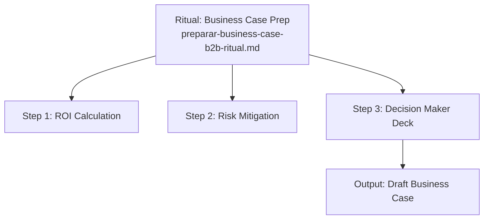

# Knowledge Graph: B2B Business Case Prep

```mermaid
graph TD
    RITUAL["Ritual: Business Case Prep<br/>preparar-business-case-b2b-ritual.md"] --> S1["Step 1: ROI Calculation"]
    RITUAL --> S2["Step 2: Risk Mitigation"]
    RITUAL --> S3["Step 3: Decision Maker Deck"]
    S3 --> T1["Output: Draft Business Case"]
```
