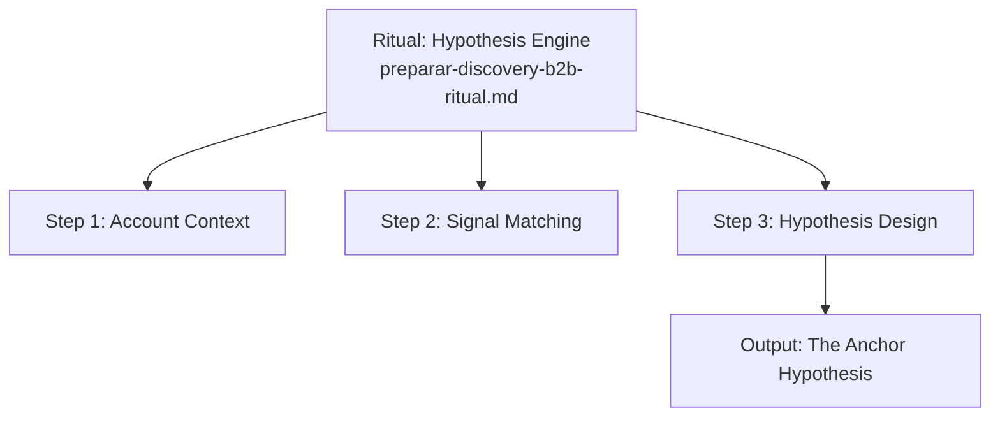

# Knowledge Graph: Discovery Prep

```mermaid
graph TD
    RITUAL["Ritual: Hypothesis Engine<br/>preparar-discovery-b2b-ritual.md"] --> S1["Step 1: Account Context"]
    RITUAL --> S2["Step 2: Signal Matching"]
    RITUAL --> S3["Step 3: Hypothesis Design"]
    S3 --> T1["Output: The Anchor Hypothesis"]
```
