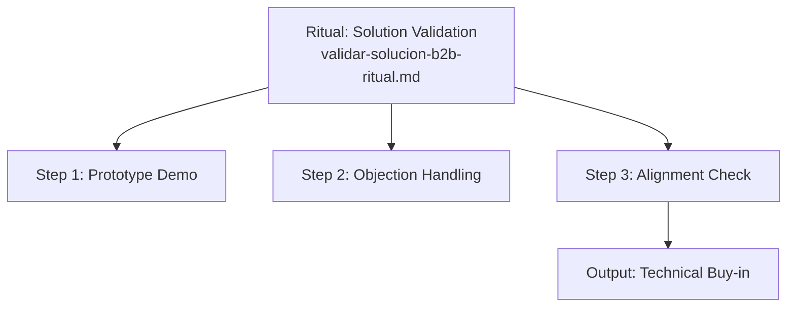

# Knowledge Graph: B2B Solution Validation

```mermaid
graph TD
    RITUAL["Ritual: Solution Validation<br/>validar-solucion-b2b-ritual.md"] --> S1["Step 1: Prototype Demo"]
    RITUAL --> S2["Step 2: Objection Handling"]
    RITUAL --> S3["Step 3: Alignment Check"]
    S3 --> T1["Output: Technical Buy-in"]
```
