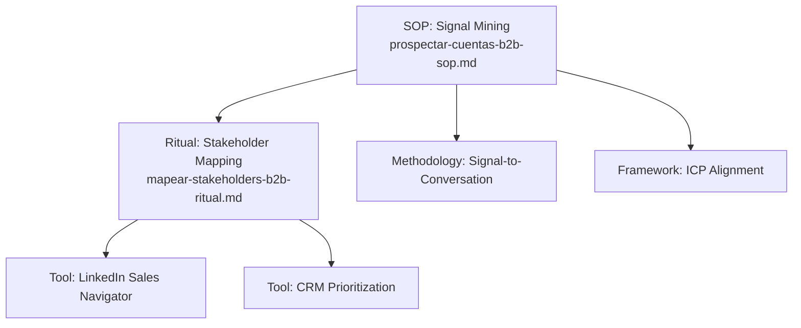

# Knowledge Graph: Scouting B2B

```mermaid
graph TD
    SOP["SOP: Signal Mining<br/>prospectar-cuentas-b2b-sop.md"] --> R1["Ritual: Stakeholder Mapping<br/>mapear-stakeholders-b2b-ritual.md"]
    SOP --> M1["Methodology: Signal-to-Conversation"]
    SOP --> M2["Framework: ICP Alignment"]
    R1 --> T1["Tool: LinkedIn Sales Navigator"]
    R1 --> T2["Tool: CRM Prioritization"]
```
