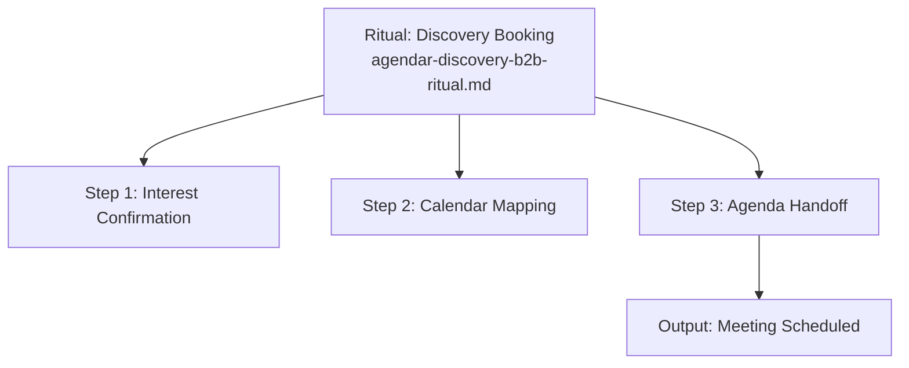

# Knowledge Graph: B2B Discovery Booking

```mermaid
graph TD
    RITUAL["Ritual: Discovery Booking<br/>agendar-discovery-b2b-ritual.md"] --> S1["Step 1: Interest Confirmation"]
    RITUAL --> S2["Step 2: Calendar Mapping"]
    RITUAL --> S3["Step 3: Agenda Handoff"]
    S3 --> T1["Output: Meeting Scheduled"]
```
