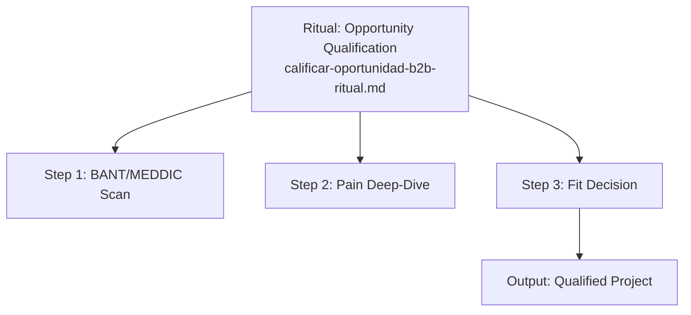

# Knowledge Graph: B2B Opportunity Qualification

```mermaid
graph TD
    RITUAL["Ritual: Opportunity Qualification<br/>calificar-oportunidad-b2b-ritual.md"] --> S1["Step 1: BANT/MEDDIC Scan"]
    RITUAL --> S2["Step 2: Pain Deep-Dive"]
    RITUAL --> S3["Step 3: Fit Decision"]
    S3 --> T1["Output: Qualified Project"]
```
