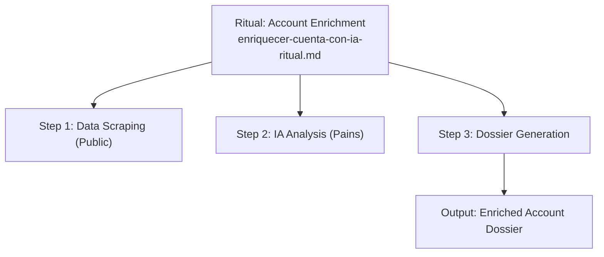

# Knowledge Graph: B2B Account Enrichment

```mermaid
graph TD
    RITUAL["Ritual: Account Enrichment<br/>enriquecer-cuenta-con-ia-ritual.md"] --> S1["Step 1: Data Scraping (Public)"]
    RITUAL --> S2["Step 2: IA Analysis (Pains)"]
    RITUAL --> S3["Step 3: Dossier Generation"]
    S3 --> T1["Output: Enriched Account Dossier"]
```
