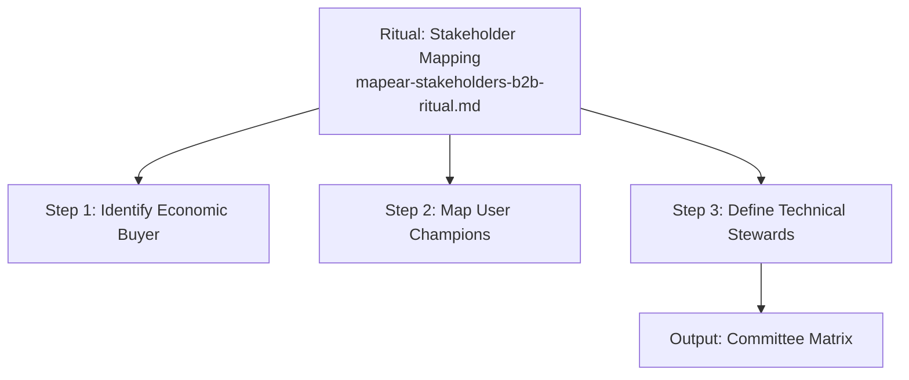

# Knowledge Graph: B2B Stakeholder Mapping

```mermaid
graph TD
    RITUAL["Ritual: Stakeholder Mapping<br/>mapear-stakeholders-b2b-ritual.md"] --> S1["Step 1: Identify Economic Buyer"]
    RITUAL --> S2["Step 2: Map User Champions"]
    RITUAL --> S3["Step 3: Define Technical Stewards"]
    S3 --> T1["Output: Committee Matrix"]
```
