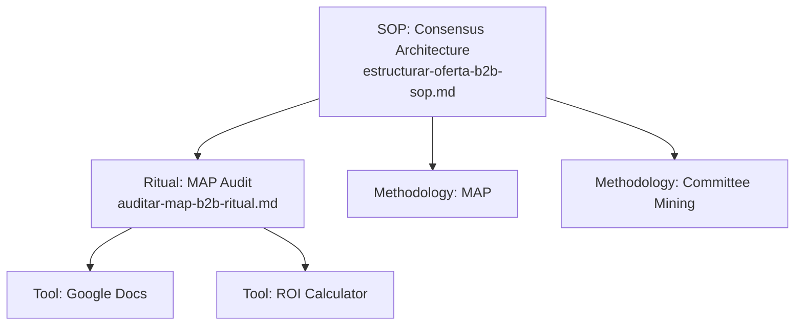

# Knowledge Graph: Structuring B2B

```mermaid
graph TD
    SOP["SOP: Consensus Architecture<br/>estructurar-oferta-b2b-sop.md"] --> R1["Ritual: MAP Audit<br/>auditar-map-b2b-ritual.md"]
    SOP --> M1["Methodology: MAP"]
    SOP --> M2["Methodology: Committee Mining"]
    R1 --> T1["Tool: Google Docs"]
    R1 --> T2["Tool: ROI Calculator"]
```
