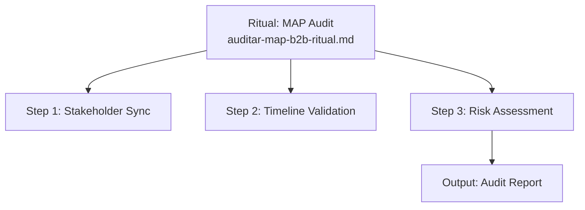

# Knowledge Graph: MAP Audit

```mermaid
graph TD
    RITUAL["Ritual: MAP Audit<br/>auditar-map-b2b-ritual.md"] --> S1["Step 1: Stakeholder Sync"]
    RITUAL --> S2["Step 2: Timeline Validation"]
    RITUAL --> S3["Step 3: Risk Assessment"]
    S3 --> T1["Output: Audit Report"]
```
