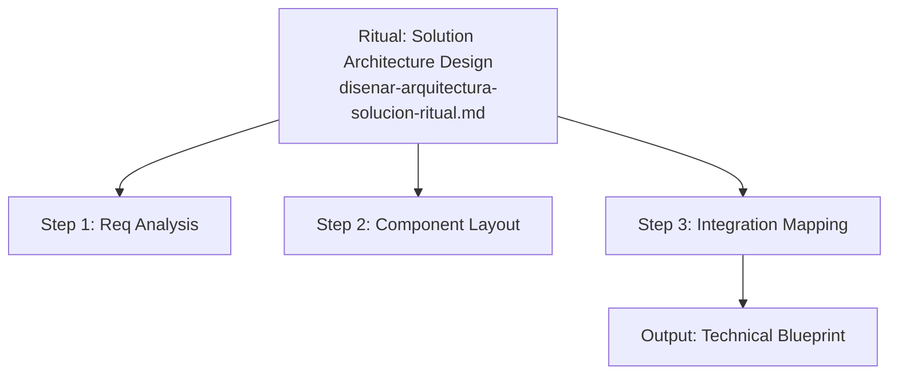

# Knowledge Graph: B2B Solution Architecture Design

```mermaid
graph TD
    RITUAL["Ritual: Solution Architecture Design<br/>disenar-arquitectura-solucion-ritual.md"] --> S1["Step 1: Req Analysis"]
    RITUAL --> S2["Step 2: Component Layout"]
    RITUAL --> S3["Step 3: Integration Mapping"]
    S3 --> T1["Output: Technical Blueprint"]
```
