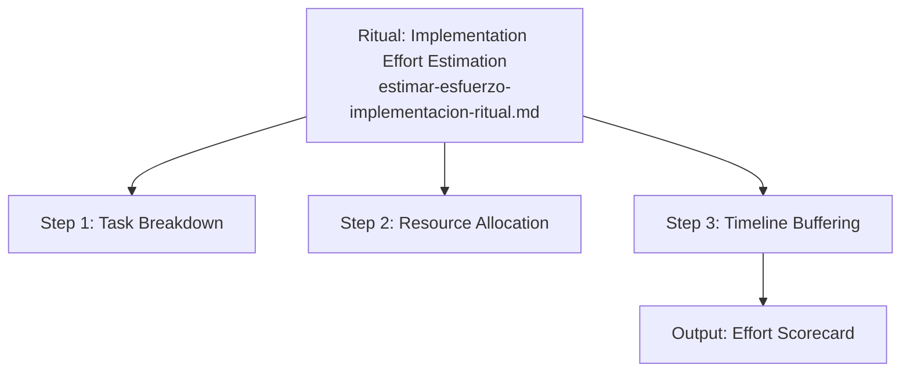

# Knowledge Graph: B2B Implementation Effort Estimation

```mermaid
graph TD
    RITUAL["Ritual: Implementation Effort Estimation<br/>estimar-esfuerzo-implementacion-ritual.md"] --> S1["Step 1: Task Breakdown"]
    RITUAL --> S2["Step 2: Resource Allocation"]
    RITUAL --> S3["Step 3: Timeline Buffering"]
    S3 --> T1["Output: Effort Scorecard"]
```
