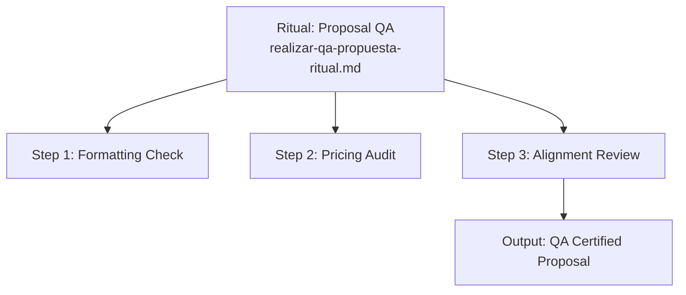

# Knowledge Graph: B2B Proposal QA

```mermaid
graph TD
    RITUAL["Ritual: Proposal QA<br/>realizar-qa-propuesta-ritual.md"] --> S1["Step 1: Formatting Check"]
    RITUAL --> S2["Step 2: Pricing Audit"]
    RITUAL --> S3["Step 3: Alignment Review"]
    S3 --> T1["Output: QA Certified Proposal"]
```
