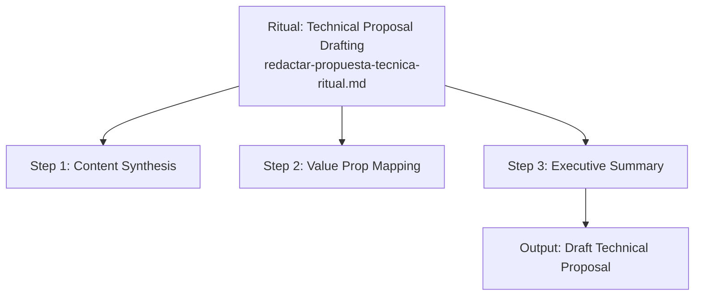

# Knowledge Graph: B2B Technical Proposal Drafting

```mermaid
graph TD
    RITUAL["Ritual: Technical Proposal Drafting<br/>redactar-propuesta-tecnica-ritual.md"] --> S1["Step 1: Content Synthesis"]
    RITUAL --> S2["Step 2: Value Prop Mapping"]
    RITUAL --> S3["Step 3: Executive Summary"]
    S3 --> T1["Output: Draft Technical Proposal"]
```
