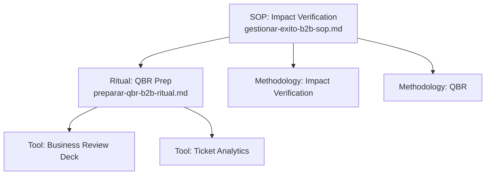

# Knowledge Graph: Success B2B

```mermaid
graph TD
    SOP["SOP: Impact Verification<br/>gestionar-exito-b2b-sop.md"] --> R1["Ritual: QBR Prep<br/>preparar-qbr-b2b-ritual.md"]
    SOP --> M1["Methodology: Impact Verification"]
    SOP --> M2["Methodology: QBR"]
    R1 --> T1["Tool: Business Review Deck"]
    R1 --> T2["Tool: Ticket Analytics"]
```
