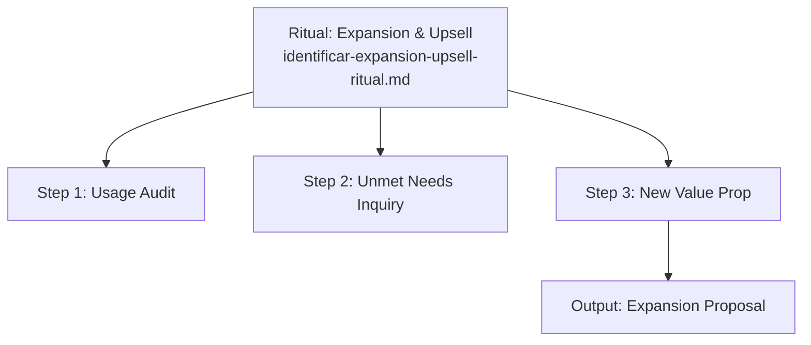

# Knowledge Graph: B2B Expansion & Upsell

```mermaid
graph TD
    RITUAL["Ritual: Expansion & Upsell<br/>identificar-expansion-upsell-ritual.md"] --> S1["Step 1: Usage Audit"]
    RITUAL --> S2["Step 2: Unmet Needs Inquiry"]
    RITUAL --> S3["Step 3: New Value Prop"]
    S3 --> T1["Output: Expansion Proposal"]
```
