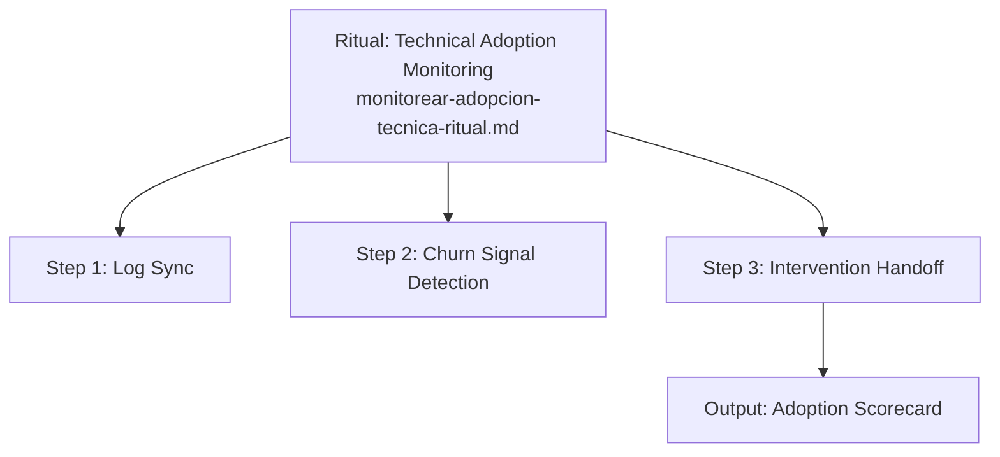

# Knowledge Graph: B2B Technical Adoption Monitoring

```mermaid
graph TD
    RITUAL["Ritual: Technical Adoption Monitoring<br/>monitorear-adopcion-tecnica-ritual.md"] --> S1["Step 1: Log Sync"]
    RITUAL --> S2["Step 2: Churn Signal Detection"]
    RITUAL --> S3["Step 3: Intervention Handoff"]
    S3 --> T1["Output: Adoption Scorecard"]
```
