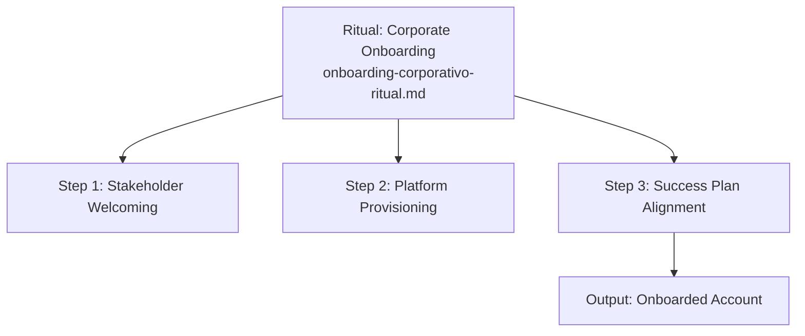

# Knowledge Graph: B2B Corporate Onboarding

```mermaid
graph TD
    RITUAL["Ritual: Corporate Onboarding<br/>onboarding-corporativo-ritual.md"] --> S1["Step 1: Stakeholder Welcoming"]
    RITUAL --> S2["Step 2: Platform Provisioning"]
    RITUAL --> S3["Step 3: Success Plan Alignment"]
    S3 --> T1["Output: Onboarded Account"]
```
