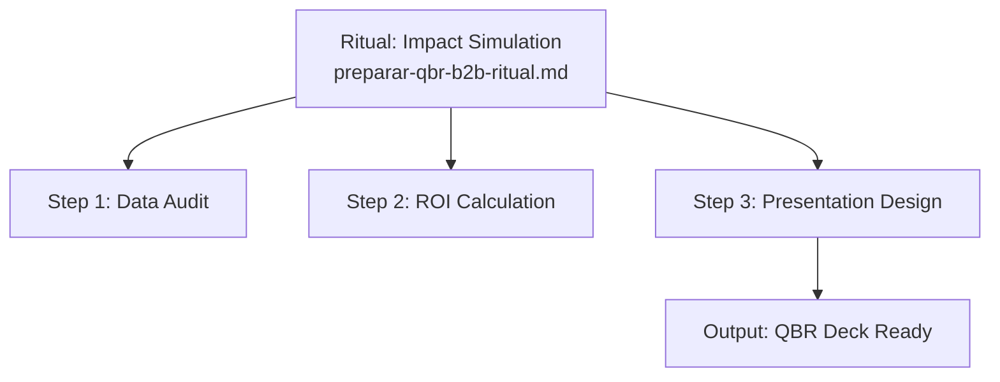

# Knowledge Graph: QBR Prep

```mermaid
graph TD
    RITUAL["Ritual: Impact Simulation<br/>preparar-qbr-b2b-ritual.md"] --> S1["Step 1: Data Audit"]
    RITUAL --> S2["Step 2: ROI Calculation"]
    RITUAL --> S3["Step 3: Presentation Design"]
    S3 --> T1["Output: QBR Deck Ready"]
```
