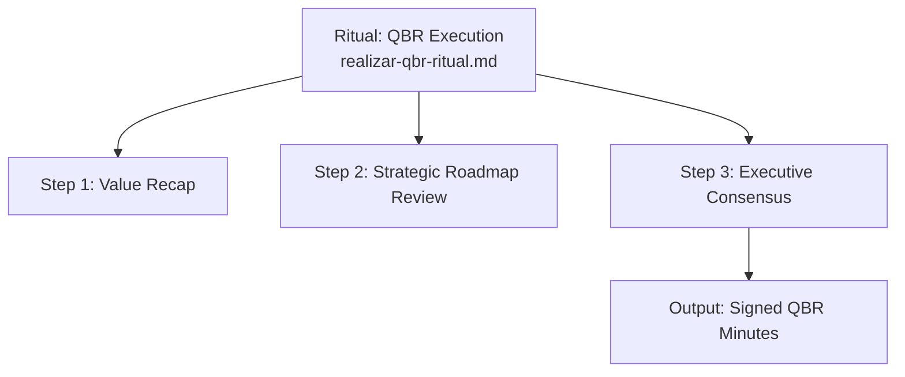

# Knowledge Graph: B2B QBR Execution

```mermaid
graph TD
    RITUAL["Ritual: QBR Execution<br/>realizar-qbr-ritual.md"] --> S1["Step 1: Value Recap"]
    RITUAL --> S2["Step 2: Strategic Roadmap Review"]
    RITUAL --> S3["Step 3: Executive Consensus"]
    S3 --> T1["Output: Signed QBR Minutes"]
```
