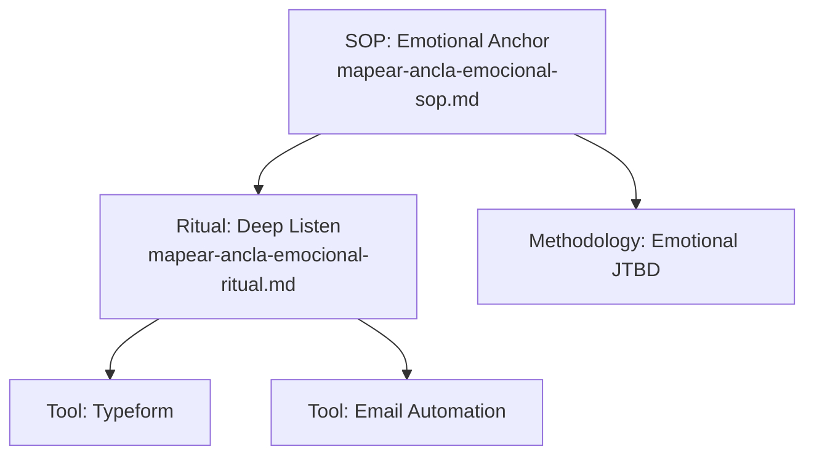

# Knowledge Graph: Discovery B2C

```mermaid
graph TD
    SOP["SOP: Emotional Anchor<br/>mapear-ancla-emocional-sop.md"] --> R1["Ritual: Deep Listen<br/>mapear-ancla-emocional-ritual.md"]
    SOP --> M1["Methodology: Emotional JTBD"]
    R1 --> T1["Tool: Typeform"]
    R1 --> T2["Tool: Email Automation"]
```
