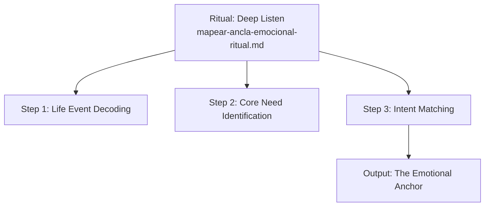

# Knowledge Graph: Emotional Mapping

```mermaid
graph TD
    RITUAL["Ritual: Deep Listen<br/>mapear-ancla-emocional-ritual.md"] --> S1["Step 1: Life Event Decoding"]
    RITUAL --> S2["Step 2: Core Need Identification"]
    RITUAL --> S3["Step 3: Intent Matching"]
    S3 --> T1["Output: The Emotional Anchor"]
```
