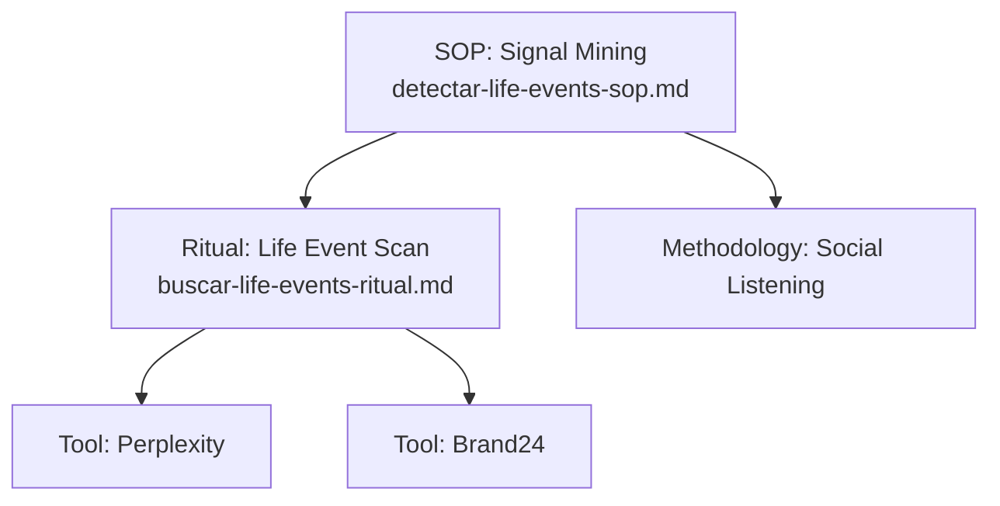

# Knowledge Graph: Scouting B2C

```mermaid
graph TD
    SOP["SOP: Signal Mining<br/>detectar-life-events-sop.md"] --> R1["Ritual: Life Event Scan<br/>buscar-life-events-ritual.md"]
    SOP --> M1["Methodology: Social Listening"]
    R1 --> T1["Tool: Perplexity"]
    R1 --> T2["Tool: Brand24"]
```
