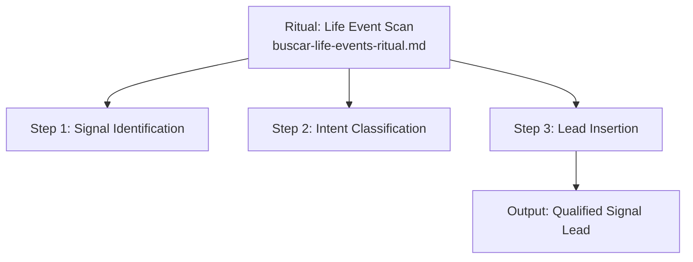

# Knowledge Graph: Life Event Scan

```mermaid
graph TD
    RITUAL["Ritual: Life Event Scan<br/>buscar-life-events-ritual.md"] --> S1["Step 1: Signal Identification"]
    RITUAL --> S2["Step 2: Intent Classification"]
    RITUAL --> S3["Step 3: Lead Insertion"]
    S3 --> T1["Output: Qualified Signal Lead"]
```
