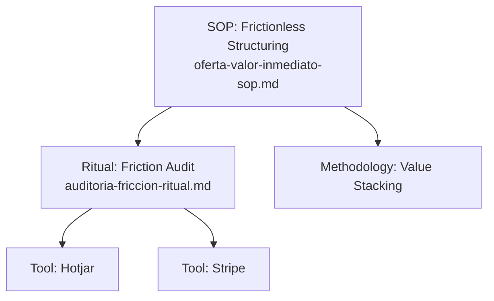

# Knowledge Graph: Structuring B2C

```mermaid
graph TD
    SOP["SOP: Frictionless Structuring<br/>oferta-valor-inmediato-sop.md"] --> R1["Ritual: Friction Audit<br/>auditoria-friccion-ritual.md"]
    SOP --> M1["Methodology: Value Stacking"]
    R1 --> T1["Tool: Hotjar"]
    R1 --> T2["Tool: Stripe"]
```
